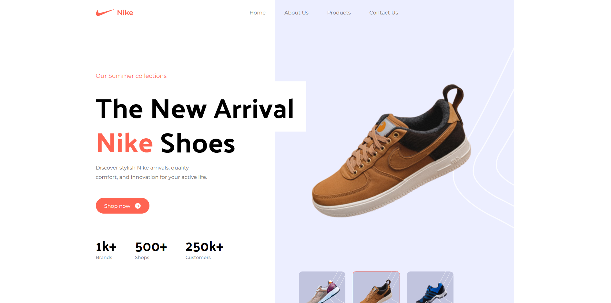
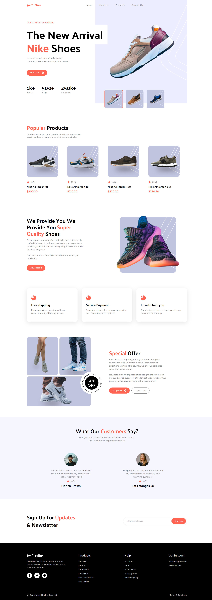

<a name="readme-top"></a>

<h1 align="center">Nike UI Website</h1>

Dive into the world of Tailwind CSS, Incredible Frontend Nike website built with Vite.js using TypeScript & React 🪐



#### [View Live](https://nike-web-ui.netlify.app)

## Table of Contents

- [Introduction](#star2-introduction)
  - [Folder Structure](#folder-structure)
- [Technologies Used](#space_invader-technologies-used)
- [Getting Started](#toolbox-getting-started)
  - [Installation and Run Locally](#gear-installation-and-run-locally)
  - [React + TypeScript + Vite](#react--typescript--vite)
    - [Expanding the ESLint configuration](#expanding-the-eslint-configuration)
- [Screenshots](#camera-screenshots)
- [Contributing](#wave-contributing)
- [License](#warning-license)
- [Contact](#handshake-contact)

## Introduction

Nike Website is a web application built with Vite.js using TypeScript & React. The application is a landing page for Nike website. The application is responsive and works great on mobile devices and tablets. The application is designed using Tailwind CSS and it is deployed on Netlify.

### Folder Structure

<b>Nike Website</b> code folder structure is as follows:

```
nike-landing-page/
├── src/
├   ├── assets/
├   ├   ├── icons/
├   ├   ├   ├── [[...]].svg
├   ├   ├   └── index.ts
├   ├   ├── images/
├   ├   ├   ├── [[...]].{svg/png/jpeg}
├   ├   ├   └── index.ts
├   ├   └── react.svg
├   ├── components/
├   ├   ├── Button.tsx
├   ├   ├── Nav.tsx
├   ├   ├── PopularProductCard.tsx
├   ├   ├── ReviewCard.tsx
├   ├   ├── ServiceCard.tsx
├   ├   └── ShoeCard.tsx
├   ├── sections/
├   ├   ├── CustomerReviews.tsx
├   ├   ├── Footer.tsx
├   ├   ├── Hero.tsx
├   ├   ├── PopularProducts.tsx
├   ├   ├── Services.tsx
├   ├   ├── SpecialOffer.tsx
├   ├   ├── Subscribe.tsx
├   ├   ├── SuperQuality.tsx
├   ├   └── index.ts
├   └── constants/
├       └── index.ts
├── public/
├   ├── favicon.ico
├   └── vite.svg
├── .eslintrc.cjs
├── .gitignore
├── index.html
├── package.json
├── postcss.config.js
├── tailwind.config.js
├── tsconfig.ts
├── tsconfig.node.json
└── vite.config.ts
```

Now let's dive into the `src/` folder and see what it contains.

#### sections

`CustomerReviews.tsx` - `Footer.tsx` - `Hero.tsx` - `PopularProducts.tsx` - `Services.tsx` - `SpecialOffer.tsx` - `Subscribe.tsx` - `SuperQuality.tsx`

The sections directory contains all the sections used in the application. Each section is a React component. The sections are imported in `src/App.tsx` and rendered in the application.

#### components

`Button.tsx` - `Nav.tsx` -`PopularProductCard.tsx` - `ReviewCard.tsx` - `ServiceCard.tsx` - `ShoeCard.tsx`

The components directory contains all the components used in the application.

#### constants

`index.ts`

This is a TypeScript code contains all the constants used in the application, specifically the Navbar & Footer Links (`navbarLinks`, `footerLinks`), the Hero Section' Shoes and Statistics (`shoes`, `statistics`), the Products (`products`), the Services (`services`), the reviews (`reviews`), the social links (`socialLinks`) constants.

#### assets

`icons/` - `images/` `react.svg`

The public directory contains the media used in the application. The assets folder contains all the images and icons used in the application.

#### files

`App.tsx` - The App component is the root component of the application. It renders all the sections.

`index.css` - The index.css file contains the global styles of the application.

`main.tsx` - The main.tsx file is the entry point of the application.

`type.ts` - The type.ts file contains all the types used in the application.

<p align="right">(<a href="#readme-top">back to top</a>)</p>

## Technologies Used

Nike web application is built using the following technologies:

- [TypeScript](https://www.typescriptlang.org/): TypeScript is a typed superset of JavaScript that compiles to plain JavaScript.
- [Vite.js](https://vitejs.dev/): Vite is a build tool that aims to provide a faster and leaner development experience for modern web projects.
- [React](https://reactjs.org/): React is an open-source, front end, JavaScript library for building user interfaces or UI components.
- [Tailwind CSS](https://tailwindcss.com/): Tailwind CSS is a utility-first CSS framework for rapidly building custom user interfaces.
- [Vercel](https://vercel.com/): Vercel is a cloud platform for frontend developers, providing the frameworks, workflows, and infrastructure to build a faster, more personalized Web.

[](https://skillicons.dev)

<p align="right">(<a href="#readme-top">back to top</a>)</p>

##  Getting Started

<!-- Installation -->

### Installation and Run Locally

#### Step 1:

Download or clone this repo by using the link below:

```bash
 https://github.com/muhammadzubairbaig/nike-web-ui.git
```

#### Step 2:

**Nike Website** using NPM (Node Package Manager), therefore, make sure that Node.js is installed by execute the following command in consle

```bash
  node -v
```

#### Step 3:

Go to root folder and execute the following command in console to get nodemon the required packages:

```bash
npm install
```

#### Step 4:

Go to root folder and execute the following command in console to start the application locally:

```bash
npm run dev
```

### React + TypeScript + Vite

This template provides a minimal setup to get React working in Vite with HMR and some ESLint rules.

Currently, two official plugins are available:

- [@vitejs/plugin-react](https://github.com/vitejs/vite-plugin-react/blob/main/packages/plugin-react/README.md) uses [Babel](https://babeljs.io/) for Fast Refresh
- [@vitejs/plugin-react-swc](https://github.com/vitejs/vite-plugin-react-swc) uses [SWC](https://swc.rs/) for Fast Refresh

#### Expanding the ESLint configuration

If you are developing a production application, we recommend updating the configuration to enable type aware lint rules:

- Configure the top-level `parserOptions` property like this:

```js
   parserOptions: {
    ecmaVersion: 'latest',
    sourceType: 'module',
    project: ['./tsconfig.json', './tsconfig.node.json'],
    tsconfigRootDir: __dirname,
   },
```

- Replace `plugin:@typescript-eslint/recommended` to `plugin:@typescript-eslint/recommended-type-checked` or `plugin:@typescript-eslint/strict-type-checked`
- Optionally add `plugin:@typescript-eslint/stylistic-type-checked`
- Install [eslint-plugin-react](https://github.com/jsx-eslint/eslint-plugin-react) and add `plugin:react/recommended` & `plugin:react/jsx-runtime` to the `extends` list

<p align="right">(<a href="#readme-top">back to top</a>)</p>

## Screenshots



<p align="right">(<a href="#readme-top">back to top</a>)</p>
